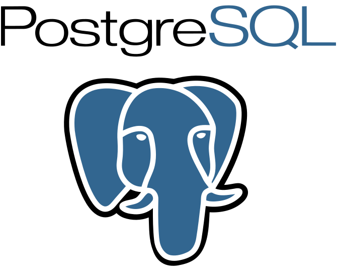

# ERD Generation Extension for StarUML v5

This extension for [StarUML](http://staruml.io) support to generate ER Data Model from database schema.

> __Note__
> This extension does not provide perfect reverse engineering. 
> If you need a complete reverse engineering feature, please check other professional reverse engineering tools.

**Supported databases**

## ER Data Model Generation

### MS SQL

1. Click the menu (`Tools > Database > MS SQL Server > Configure Server...`)
1. Configure Database Connection Preferences
1. Choose one of the following to generate ER Data Model
    * Click the menu (`Tools > Database > MS SQL Server > Generate ER Data Model...`) or 
    * Press the shortcut key(`Alt + Shift + M`)
1. Model will be created in the Project (If there is no open project, it will be created)

### PostgreSQL

1. Click the menu (`Tools > Database > PostgreSQL Server > Configure Server...`)
1. Configure Database Connection Preferences
1. Choose one of the following to generate ER Data Model
    * Click the menu (`Tools > Database > PostgreSQL Server > Generate ER Data Model...`) or 
    * Press the shortcut key(`Alt + Shift + L`)
1. Model will be created in the Project (If there is no open project, it will be created)

### MySQL

1. Click the menu (`Tools > Database > MySQL Server > Configure Server...`)
1. Configure Database Connection Preferences
1. Choose one of the following to generate ER Data Model
    * Click the menu (`Tools > Database > MySQL Server > Generate ER Data Model...`) or 
    * Press the shortcut key(`Alt + Shift + P`)
1. Model will be created in the Project (If there is no open project, it will be created)

Belows are the rules to convert from database schema to ER Data Model elements.

### Table

* Converted to `type.ERDEntity`
* Set the below properties:
    * name: `string`
    * columns: `Array<type.ERDColumn>`

### Column

* Converted to `type.ERDColumn`
* Set the below properties:
    * name: `string`
    * primaryKey: `boolean`
    * nullable: `boolean`
    * foreignKey: `boolean`
    * type: `string`
    * length: `string`
    * unique: `boolean`
    * referenceTo: `type.ERDColumn`

### Relationship

* Converted to `type.ERDRelationship`
* Set the below properties:
    * foreignKeyName: `string`
    * identifying: `boolean`
    * end1: `type.ERDRelationshipEnd`
    * end2: `type.ERDRelationshipEnd`

#### RelationshipEnd

* Converted to `type.ERDRelationshipEnd`
* Set the below properties:
    * name: `string`
    * identifying: `boolean`
    * cardinality: `string`
    * reference: `type.ERDColumn`
